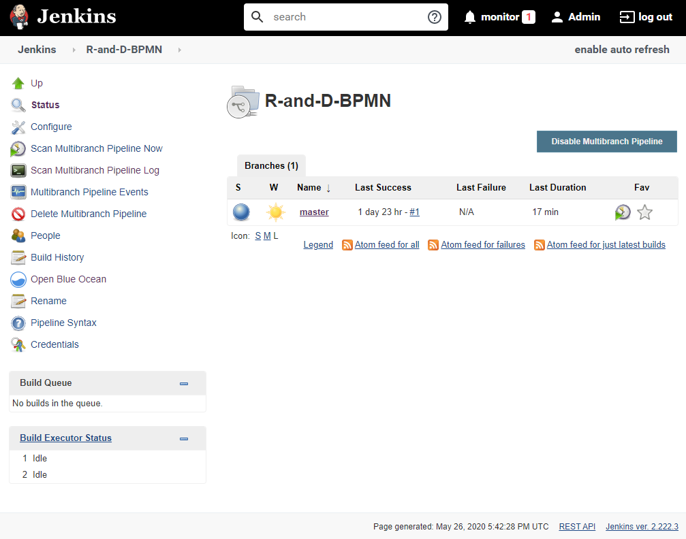
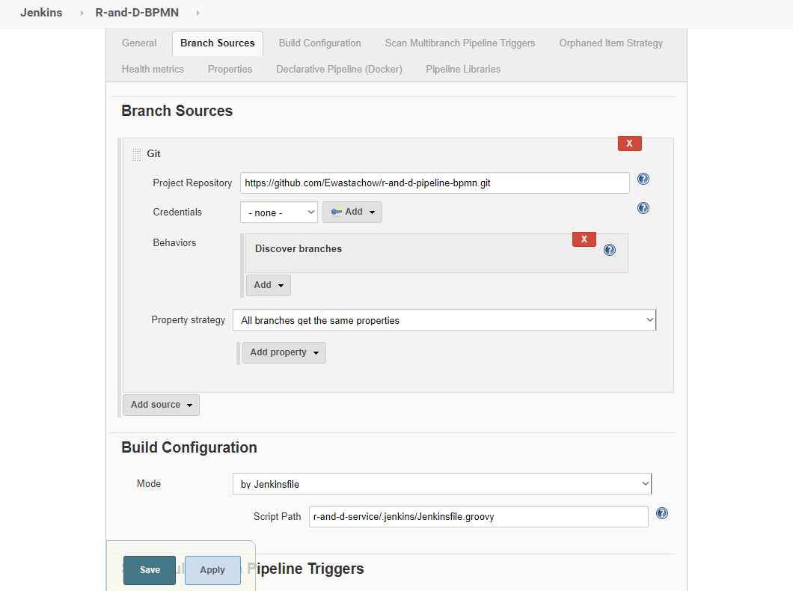
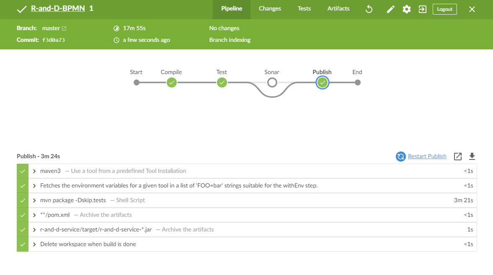
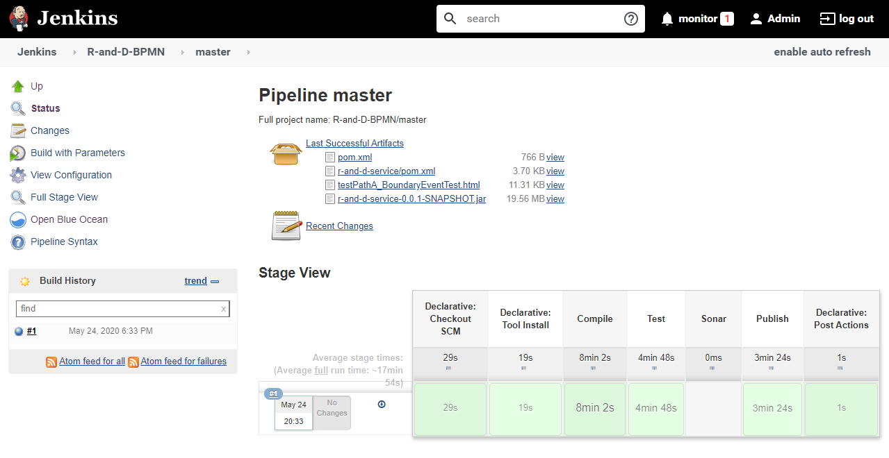
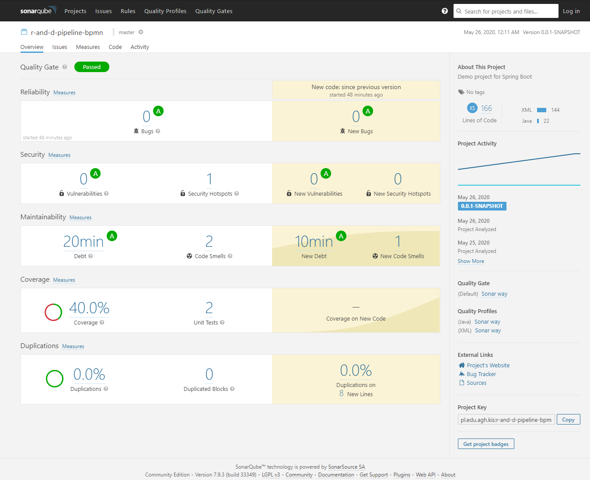
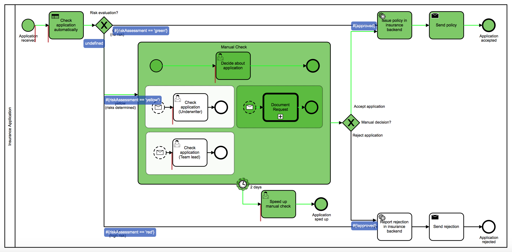
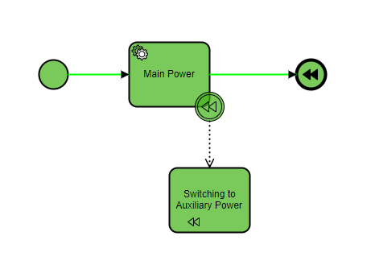
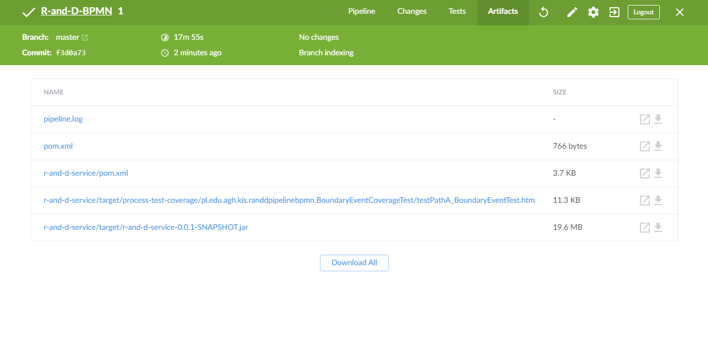
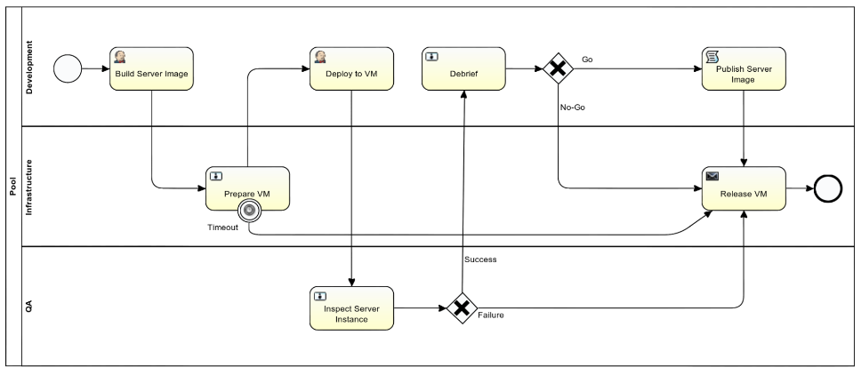
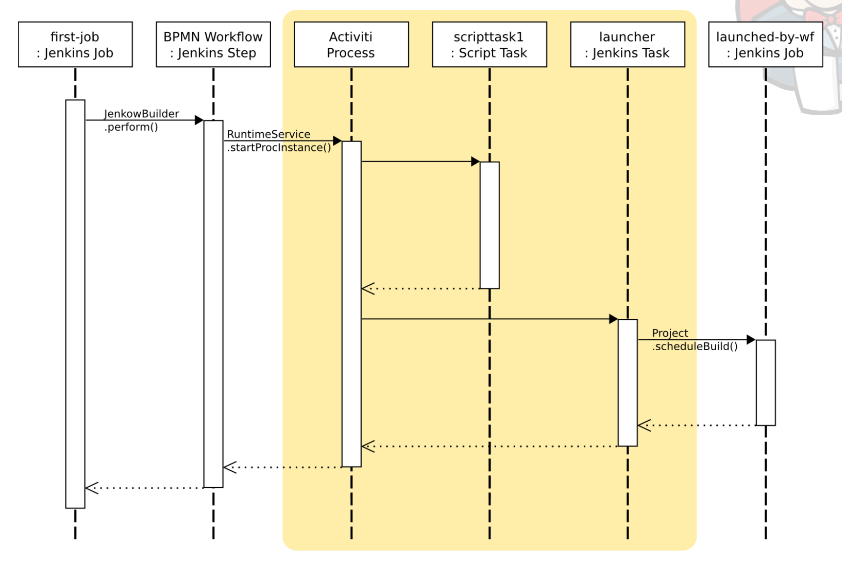

# R&D BPMN in projects development

## Temat projektu

Analiza możliwości budowy środowiska pozwalającego na automatyzację pracy 
z aplikacjami z uwzględnieniem procesów biznesowych (modelowania procesów)

Środowisko bazujące na jenkinsie, sonarze, bitbucketcie oraz biblioteka skryptów jenkinsowych 
i przykładowy projekt, którego flow zostanie zautomatyzowane za pomocą tych narzędzi.
Pipeline będzie domyślnie wspierał aplikacje napisane w języku java oraz korzystające 
z mavena jako narzędzia do budowania. Pipeline będzie odpowiedzialny za budowanie, 
testowanie, statyczną analizę kodu oraz deploy aplikacji.
Analiza literaturowa zastosowania modeli procesów w CICD, przykłady z literatury, 
gdzie i jak stosowano, na których etapach.

### Czyli

Projekt składa się z 2 części:
* Środowisko integracyjne dla pracy nad projektem z uwzględniem badanis pokrycia ścieżek w diagramach BPMN
* Tworzenie pipelinów jako modeli BPMN przy użyciu Jenkow


## Jenkins & Sonar infrastructure
Plik: [docker-compose.yml](r-and-d-infrastructure/docker-compose.yml)

Uruchomienie:
```shell script
cd r-and-d-infrastructure
docker-compose up
```

### Jenkins
#### Środowisko
Jenkins login: admin/admin

URL: [http://localhost:8001/](http://localhost:8001/)

`JENKINS_HOME` dla skonfigurowanego serwera ze wsparciem dla sonara oraz jobem dla tego projektu 
w `r-and-d-infrastructure/jenkins_home`, automatycznie załączany dla `r-and-d-infrastructure/docker-compose.yml`

```yaml
  jenkins:
    image: jenkins/jenkins:lts
    restart: unless-stopped
    ports:
      - 8001:8080
      - 50000:50000
    volumes:
      - ./jenkins_home:/var/jenkins_home
      - /var/run/docker.sock:/var/run/docker.sock
```

Konfiguracja główna:

```xml
<?xml version='1.1' encoding='UTF-8'?>
<hudson>
  <disabledAdministrativeMonitors/>
  <version>2.222.3</version>
  <installStateName>RUNNING</installStateName>
  <numExecutors>2</numExecutors>
  <mode>NORMAL</mode>
  <useSecurity>true</useSecurity>
  <authorizationStrategy class="hudson.security.FullControlOnceLoggedInAuthorizationStrategy">
    <denyAnonymousReadAccess>true</denyAnonymousReadAccess>
  </authorizationStrategy>
  <securityRealm class="hudson.security.HudsonPrivateSecurityRealm">
    <disableSignup>true</disableSignup>
    <enableCaptcha>false</enableCaptcha>
  </securityRealm>
  <disableRememberMe>false</disableRememberMe>
  <projectNamingStrategy class="jenkins.model.ProjectNamingStrategy$DefaultProjectNamingStrategy"/>
  <workspaceDir>${JENKINS_HOME}/workspace/${ITEM_FULL_NAME}</workspaceDir>
  <buildsDir>${ITEM_ROOTDIR}/builds</buildsDir>
  <jdks>
    <jdk>
      <name>openjdk11</name>
      <home></home>
      <properties>
        <hudson.tools.InstallSourceProperty>
          <installers>
            <io.jenkins.plugins.adoptopenjdk.AdoptOpenJDKInstaller plugin="adoptopenjdk@1.2">
              <id>jdk-11.0.7+10.2</id>
            </io.jenkins.plugins.adoptopenjdk.AdoptOpenJDKInstaller>
          </installers>
        </hudson.tools.InstallSourceProperty>
      </properties>
    </jdk>
  </jdks>
  <viewsTabBar class="hudson.views.DefaultViewsTabBar"/>
  <myViewsTabBar class="hudson.views.DefaultMyViewsTabBar"/>
  <clouds/>
  <quietPeriod>5</quietPeriod>
  <scmCheckoutRetryCount>0</scmCheckoutRetryCount>
  <views>
    <hudson.model.AllView>
      <owner class="hudson" reference="../../.."/>
      <name>all</name>
      <filterExecutors>false</filterExecutors>
      <filterQueue>false</filterQueue>
      <properties class="hudson.model.View$PropertyList"/>
    </hudson.model.AllView>
  </views>
  <primaryView>all</primaryView>
  <slaveAgentPort>50000</slaveAgentPort>
  <label></label>
  <crumbIssuer class="hudson.security.csrf.DefaultCrumbIssuer">
    <excludeClientIPFromCrumb>false</excludeClientIPFromCrumb>
  </crumbIssuer>
  <nodeProperties/>
  <globalNodeProperties/>
  <noUsageStatistics>true</noUsageStatistics>
</hudson>
```

#### Multibranch pipeline
Pierwsze odpalenie joba może trwać długo (do godziny) ponieważ pobierane są wszystkie zależności




Pipeline znajduje się: [r-and-d-service/.jenkins/Jenkinsfile.groovy](r-and-d-service/.jenkins/Jenkinsfile.groovy)

```groovy
#!/usr/bin/env groovy

pipeline {
    agent any
    tools {
        jdk 'openjdk11'
        maven 'maven3'
    }
    options {
        timestamps()
        disableConcurrentBuilds()
        buildDiscarder(
                logRotator(
                        numToKeepStr: '5',
                        daysToKeepStr: '20'
                )
        )
    }
    parameters {
        booleanParam(name: 'WITH_SONAR', defaultValue: false, description: 'Should run Sonar analysis?')
    }
    stages {
        //...
    }
    post {
        cleanup {
            cleanWs()
        }
    }
}
```

`timestamps()` - dodaje timestamp do logów
`disableConcurrentBuilds()` - nie pozwala na odpalenie jednocześnie wielu buildów dla joba (przy czym należy pamiętać że multibranch pipeline może tworzyć jednocześnie wiele niezależnych jobów)
`buildDiscarder(...)` - konfiguracja przez ile czasu będzie trzymana hostoria buidlów
`cleanWs()` - czyszczenie workspace

Więcej informacji na temat składni pipelinów: [https://www.jenkins.io/doc/book/pipeline/syntax/](https://www.jenkins.io/doc/book/pipeline/syntax/)

#### Stages

Kompilacja:
```groovy
        stage('Compile') {
            steps {
                sh 'mvn clean compile'
            }
        }
```
Testy:
```groovy
        stage('Test') {
            steps {
                sh 'mvn test'
            }
            post {
                success {
                    archiveArtifacts artifacts: '**/process-test-coverage/*/*.html'
                }
            }
        }
```
Publish:
```groovy
        stage('Publish') {
            steps {
                sh 'mvn package -Dskip.tests'
            }
            post {
                success {
                    archiveArtifacts artifacts: '**/pom.xml'
                    archiveArtifacts artifacts: 'r-and-d-service/target/r-and-d-service-*.jar'
                }
            }
        }
```



### SonarQube
#### Środowisko
Sonar login: admin/admin

URL: [http://localhost:9000/](http://localhost:9000/)
```yaml
  sonarqube:
    image: sonarqube:lts
    ports:
      - 9000:9000
    environment:
      - sonar.jdbc.username=sonar
      - sonar.jdbc.password=sonar
      - sonar.jdbc.url=jdbc:postgresql://db/sonar
  db:
    image: postgres
    environment:
      - POSTGRES_USER=sonar
      - POSTGRES_PASSWORD=sonar
```
#### Branch community plugin
[sonarqube-community-branch-plugin](https://github.com/mc1arke/sonarqube-community-branch-plugin)

Parametry wywołania
* Branch: `-Dsonar.branch.name=${BRANCH_NAME}`
* Pull request: `-Dsonar.pullrequest.key=${PR_ID} -Dsonar.pullrequest.branch=${CHANGE_BRANCH} -Dsonar.pullrequest.base=${CHANGE_TARGET}`

#### Przykładowy stage dla pipelinu
```groovy
        stage('Sonar') {
            when {
                expression { return params.WITH_SONAR }
            }
            stages {
                stage('Sonar PR') {
                    when {
                        branch pattern: "PR-\\d+", comparator: "REGEXP"
                    }
                    environment {
                        PR_ID = "${BRANCH_NAME}".replace("PR-", "")
                        SONAR_PR_PARAMS = "-Dsonar.pullrequest.key=${PR_ID} -Dsonar.pullrequest.branch=${CHANGE_BRANCH} -Dsonar.pullrequest.base=${CHANGE_TARGET}"
                    }
                    steps {
                        dir('r-and-d-service') {
                            withSonarQubeEnv('SonarQube') {
                                sh "mvn sonar:sonar ${SONAR_PR_PARAMS}"
                            }
                        }
                    }
                }
                stage('Sonar branch') {
                    when {
                        not {
                            branch pattern: "PR-\\d+", comparator: "REGEXP"
                        }
                    }
                    environment {
                        SONAR_BRANCH_PARAMS = "-Dsonar.branch.name=${BRANCH_NAME}"
                    }
                    steps {
                        dir('r-and-d-service') {
                            withSonarQubeEnv('SonarQube') {
                                sh "mvn sonar:sonar ${SONAR_BRANCH_PARAMS}"
                            }
                        }
                    }
                }
            }
        }
```
#### Konfiguracja mavena
```xml
<project>
...
	<properties>
		<sonar.coverage.jacoco.xmlReportPaths>target/site/jacoco/jacoco.xml</sonar.coverage.jacoco.xmlReportPaths>
	</properties>

	<build>
		<plugins>
			<plugin>
				<groupId>org.jacoco</groupId>
				<artifactId>jacoco-maven-plugin</artifactId>
				<version>0.8.5</version>
				<executions>
					<execution>
						<id>prepare-agent</id>
						<goals>
							<goal>prepare-agent</goal>
						</goals>
					</execution>
					<execution>
						<id>report</id>
						<goals>
							<goal>report</goal>
						</goals>
					</execution>
				</executions>
			</plugin>
			<plugin>
				<groupId>org.sonarsource.scanner.maven</groupId>
				<artifactId>sonar-maven-plugin</artifactId>
				<version>3.7.0.1746</version>
			</plugin>
		</plugins>
	</build>
...
</project>
```
#### Konfiguracja jenkins
```xml
<hudson.plugins.sonar.SonarGlobalConfiguration plugin="sonar@2.11">
  <jenkinsSupplier class="hudson.plugins.sonar.SonarGlobalConfiguration$$Lambda$263/1722858414"/>
  <installations>
    <hudson.plugins.sonar.SonarInstallation>
      <name>SonarQube</name>
      <serverUrl>http://sonarqube:9000</serverUrl>
      <credentialsId></credentialsId>
      <webhookSecretId></webhookSecretId>
      <mojoVersion></mojoVersion>
      <additionalProperties></additionalProperties>
      <additionalAnalysisProperties></additionalAnalysisProperties>
      <triggers>
        <skipScmCause>false</skipScmCause>
        <skipUpstreamCause>false</skipUpstreamCause>
        <envVar></envVar>
      </triggers>
    </hudson.plugins.sonar.SonarInstallation>
  </installations>
  <buildWrapperEnabled>false</buildWrapperEnabled>
  <dataMigrated>true</dataMigrated>
  <credentialsMigrated>true</credentialsMigrated>
</hudson.plugins.sonar.SonarGlobalConfiguration>
```
#### UI


## BPMN code coverage
Źródło: [https://github.com/camunda/camunda-bpm-process-test-coverage](https://github.com/camunda/camunda-bpm-process-test-coverage)


Plugin generuje wizualizację pokrycia ścieżki jako plik html, który wymaga [bpmn-js](https://bpmn.io/toolkit/bpmn-js/) 
do wizualizacji, przy czym jednoczenie source niezbędne do wizualizacji są umieszczane w folderze `target` razem z plikami `html`

### Przykład z projektu

Plik dla projektu: `r-and-d-service/target/process-test-coverage/pl.edu.agh.kis.randdpipelinebpmn.BoundaryEventCoverageTest/testPathA_BoundaryEventTest.html`

Uruchomienie pliku html z takie lokalizacji po zbudowaniu projketu pozwala na poprawne wyświetlenie diagramu



Testowany plik BPMN: [boundaryEventTest.bpmn](r-and-d-service/src/main/resources/boundaryEventTest.bpmn)

#### Configuration

Wymagany plik w resources dla testów: [camunda.cfg.xml](r-and-d-service/src/test/resources/camunda.cfg.xml)

```xml
<project>
    <dependencies>
		<dependency>
			<groupId>org.camunda.bpm.extension</groupId>
			<artifactId>camunda-bpm-process-test-coverage</artifactId>
			<version>0.3.2</version>
			<scope>test</scope>
		</dependency>
		<dependency>
			<groupId>org.camunda.bpm</groupId>
			<artifactId>camunda-engine</artifactId>
			<version>${camunda.version}</version>
			<scope>test</scope>
		</dependency>
		<dependency>
			<groupId>org.camunda.bpm</groupId>
			<artifactId>camunda-engine-spring</artifactId>
			<version>${camunda.version}</version>
			<scope>test</scope>
		</dependency>

		<dependency>
			<groupId>junit</groupId>
			<artifactId>junit</artifactId>
			<version>4.12</version>
		</dependency>
		<dependency>
			<!-- Needed for InMemoryH2Test -->
			<groupId>com.h2database</groupId>
			<artifactId>h2</artifactId>
			<version>1.3.168</version>
			<scope>test</scope>
		</dependency>
		<dependency>
			<!-- Needed to test SpringProcessWithCoverageTest -->
			<groupId>org.springframework</groupId>
			<artifactId>spring-test</artifactId>
			<version>3.1.2.RELEASE</version>
			<scope>test</scope>
		</dependency>
		<dependency>
			<!-- Needed to test SpringProcessWithCoverageTest -->
			<groupId>cglib</groupId>
			<artifactId>cglib</artifactId>
			<version>2.2.2</version>
			<scope>test</scope>
		</dependency>    
    </dependencies>
</project>
```

Test:
```java
public class BoundaryEventCoverageTest {

    private static final String BPMN_PATH = "boundaryEventTest.bpmn";
    private static final String PROCESS_DEFINITION_KEY = "BoundaryEventTest";

    @Rule
    public TestCoverageProcessEngineRule rule = TestCoverageProcessEngineRuleBuilder.create().withDetailedCoverageLogging().build();

    @Test
    @Deployment(resources = BPMN_PATH)
    public void testPathA() {
        rule.getRuntimeService().startProcessInstanceByKey(PROCESS_DEFINITION_KEY);
    }

}
```

Inny przykład parametryzowany:
```java
public class MultipleDeploymentsForIndividualTestsTest {

    private static final String PROCESS_DEFINITION_KEY = "super-process-test-coverage";
    
    @Rule
    @ClassRule
    public static TestCoverageProcessEngineRule rule = TestCoverageProcessEngineRuleBuilder.create().build();

    @Test
    @Deployment(resources = { "superProcess.bpmn", "process.bpmn" })
    public void testPathAAndSuperPathA() {
        
        Map<String, Object> variables = new HashMap<String, Object>();
        variables.put("path", "A");
        variables.put("superPath", "A");
        rule.getRuntimeService().startProcessInstanceByKey(PROCESS_DEFINITION_KEY, variables);
        
        rule.addTestMethodCoverageAssertionMatcher("testPathAAndSuperPathA", greaterThan(6.9 / 11.0));
        rule.addTestMethodCoverageAssertionMatcher("testPathAAndSuperPathA", lessThan(9 / 11.0));

    }
}
```

#### Archiwizacja wyników przy użyciu pipelinu

Pipeline archiwizuje wygenerowane diagramy jako artefakty:
```groovy
archiveArtifacts artifacts: '**/process-test-coverage/*/*.html'
```


## Jenkow - Jenkins in BPMN Workflows
### Business Process Model and Notation (BPMN) Workflows in Jenkins
[2012 San Fran JUC: Max Spring - Business Process Model and Notation (BPMN) Workflows in Jenkins](https://www.youtube.com/watch?v=lcZh2tvqC-A)
Przykład zastosowania jenkisa w procesach biznesowych modelowanych za pomocą BPMN
[Prezentacja z prelekcji](https://github.com/jenkinsci/jenkow-plugin/blob/master/docs/juc-sf2012-mspring-jenkow.pdf) - screeny w tej sekcji pochodzą z tej prezentacji

Niestety projekt jest już nie utrzymywany, ale bardzo mocno wpasowuje się w tematykę.
[https://wiki.jenkins.io/display/JENKINS/Jenkow+Plugin](https://wiki.jenkins.io/display/JENKINS/Jenkow+Plugin)

Działanie bazuje na silniku Activity:
* open source
* bazuje na javie (tak jak jenkins)
* wsparcie dla eclipse w kontekście tworzenia diagramów

#### Co? Jak? Po co? Dlaczego?
Problem: orchiestracja jobów - ogarnięcie zależności między nimi

* Dodanie `Jenkins task` jak dowolnego innego taska w takim diagramie (np. `User task` / `Script task`).
* Zachowane są zależnośi między nimi tak jak pomiędzy dowolnymi innymi taskami w diagramach BPMN. 
* Integracja pomiędzy zadaniami jenkinsowymi a zadaniami ludzi

* Trzymanie definicji diagramów w repozytorium git - przy czym jenkis przy pomocy pluginu tworzy takie repozytorium - adres dostępny w UI jenkinsa
* `Jenkins task` - wywołanie innego joba jenkinsowego o określonej nazwie




Ze względu na to że projekt nie jest utrzymywany i nie jest kompatybilny z Jenkinsem w wersji 2 pliki hpi zostały usunięte z repozytorium pluginów jenkinsa,
umieściłam je w katalogu `jenkow`, niestety nie gwarantuje pomyślnego uruchomienia flow nawet z ich pomocą.
Instrukcja konfiguracji: [https://wiki.jenkins.io/pages/viewpage.action?pageId=60918754](https://wiki.jenkins.io/pages/viewpage.action?pageId=60918754)

